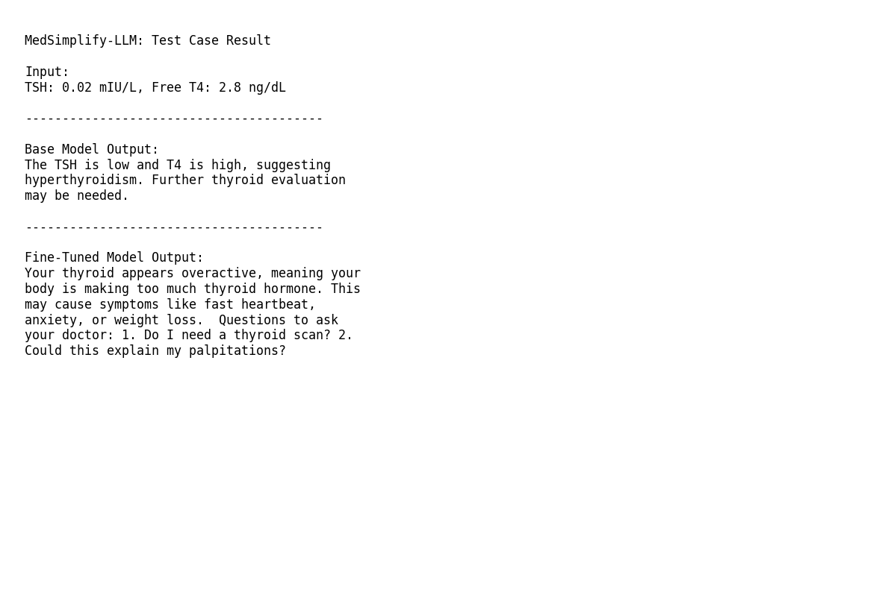

# MedSimplify-LLM 
### Clinical Report Translation using Fine-Tuned Llama 3.2 1B for Patient-Centric Medical Literacy  

---

## Project Overview  

**MedSimplify-LLM** is a domain-specific Large Language Model fine-tuned to bridge the **clinical jargon gap** between healthcare professionals and patients.  

It transforms complex medical lab reports and clinical notes into:  
- **simple, patient-friendly explanations**  
- **context-aware risk interpretation**  
- **actionable follow-up questions** for doctor consultations  

This project focuses on making healthcare information more understandable, accessible, and useful for non-technical users.

---

## Key Features  

### -> Contextual Simplification  
Converts technical lab parameters and abbreviations such as:  
- HbA1c  
- TSH / T3 / T4  
- Anti-TPO Antibodies  
- LDL / HDL Cholesterol  
- CBC parameters  

into plain-language explanations.

---

### -> Risk Contextualization  
Explains not only **what the abnormal value is**, but also:  
- why it may matter  
- what body system it affects  
- what symptoms it may relate to  

---

### -> Patient Empowerment  
Generates 2–3 relevant follow-up questions for patients to ask their doctors to make consultations more productive.

---

## Technical Implementation (NVIDIA-Optimized)  

This project was designed for **compute efficiency**, **rapid prototyping**, and **deployment readiness**, using an NVIDIA-friendly optimized stack.

---

### Base Model  
- **Model:** Llama-3.2-1B-Instruct  

---

### Optimization Stack  

#### **Unsloth**
Used for:
- faster training kernels  
- lower memory consumption  
- simplified QLoRA pipeline  

Benefits:
- ~2x faster fine-tuning  
- up to ~70% reduced VRAM usage  

---

#### **QLoRA (4-bit Quantization)**  
Implemented using:
- **bitsandbytes**
- **PEFT**

Purpose:
- compresses model weights to fit on low-memory GPUs (Tesla T4 / Colab)

Benefits:
- reduced GPU memory usage  
- maintains strong performance  

---

#### **PEFT (Parameter-Efficient Fine-Tuning)**  
Fine-tuned only adapter layers instead of full model weights.

Target modules:
- `q_proj`
- `k_proj`
- `v_proj`
- `o_proj`

Benefits:
- faster training  
- lower compute cost  
- stable adaptation  

---

## Training Hyperparameters  

| Parameter | Value |
|----------|-------|
| Base Model | Llama-3.2-1B-Instruct |
| LoRA Rank (r) | 16 |
| LoRA Alpha | 32 |
| Learning Rate | 2e-4 |
| Optimizer | AdamW (8-bit) |
| Scheduler | Linear |
| Precision | FP16 |
| Max Steps | 60 |
| Batch Size | 2 |

---

## Dataset  

Fine-tuned on a custom synthetic medical instruction dataset containing:  
- CBC reports  
- thyroid panels  
- liver function tests  
- kidney markers  
- cholesterol profiles  
- vitamin deficiencies  

Each sample contains:
- **instruction:** structured medical report  
- **output:** simplified explanation + follow-up questions  

---

## Evaluation: Before vs After Fine-Tuning  

## Sample Test Case

